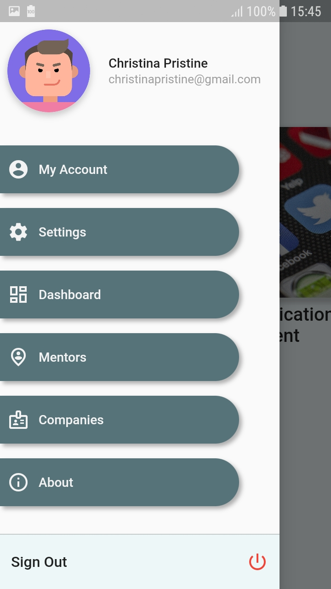
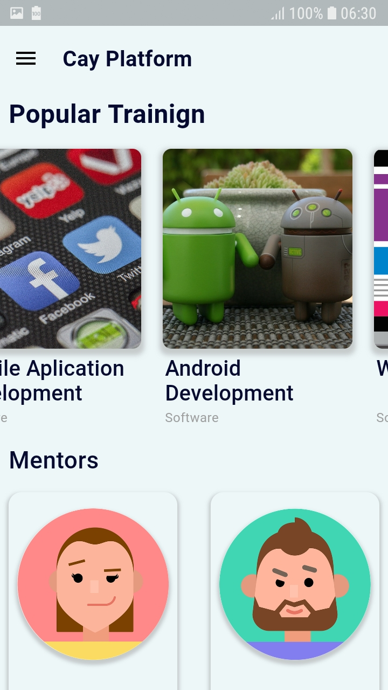
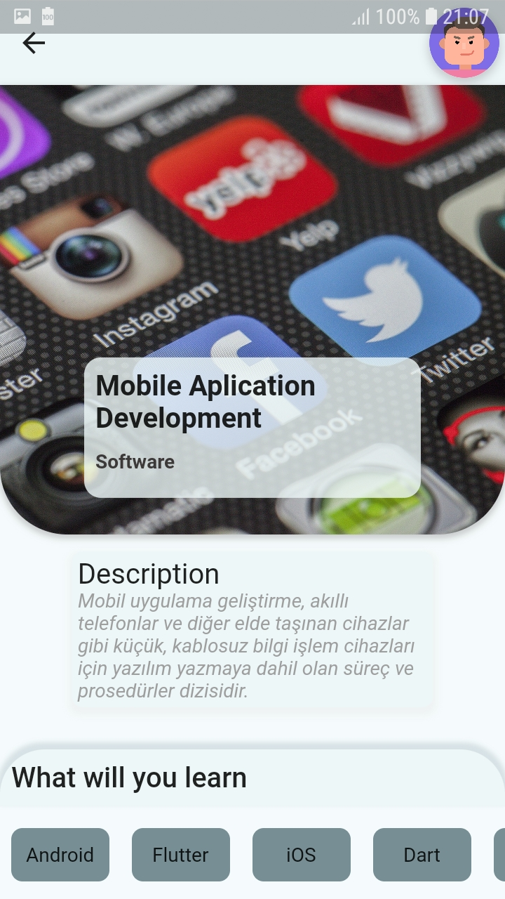
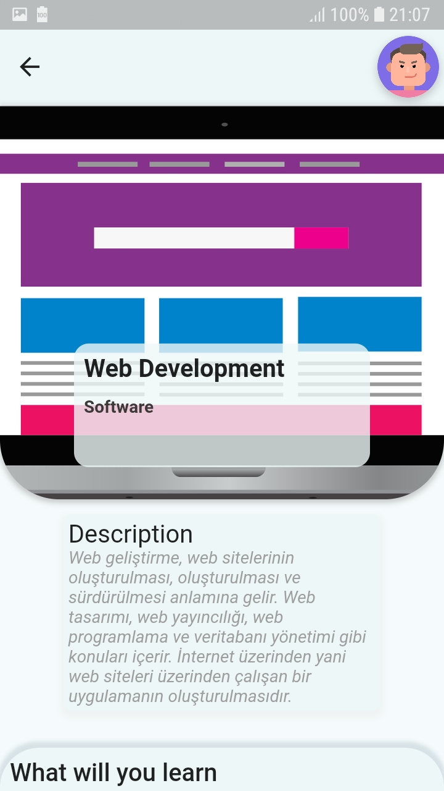
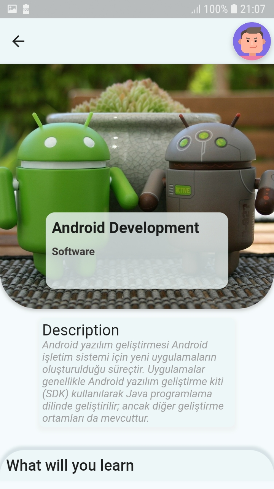

# cay_platform

Bu uygulamadaki hedefimiz Mesleğe yeni başlamak isteyen ve ne öğrenmesi gerektiğini bilmek isteyen insanlara mentorler aracılığıyla yardımcı olmak.  - Kullanıcı olmak istediği mesleğe göre genel bilgilendirmeyi traininglerden veya company sayfasından kolayca alabilecek. 
- Dashboard sayfasından aldığı traininge göre ilerlemesini görebilecek. 
- Mentors sayfasından sorularını istediği mentöre sorabilecek. Mentorlerin bir diğer görevi kullanıcının ilerlemesini gözlemlemek.
- Companies sayfasından şirketleri gözlemleyip neler öğrenebileğini gözlemleyebilecek

  
  
  
  
  

#Gelecekteki hedeflerimiz

- Süre sıkıntısından dolayı ekleyemediğimiz sayfaları ekleyip etkili bir UI oluşturmak. 
- Mesleklerle alakalı mentörlere ulaşıp sistemimize dahil etmek.
- İlgili şirketlerle iletişime geçip, projemize dahil etmek 
- Database ile ilgili olan kısmı tamamlamak.
- Arayüzü güncellemek
- Dashboard sayfamızı kullancının kendi gelişimini görüp motive olucağı şekilde tasarlamak

#Github Hesaplarımız

- https://github.com/EmirhanSerin1

- https://github.com/Malsaeed276